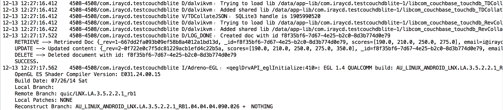

# Trying CouchDB Lite Android

This is the most simplest code for CRUD using CouchDB Lite on Android.
It's simple and just jump into it and use it.

Entire thing is written in `PlaceholderFragment` insdie `MainActivity.java`

[`MainActivity.java`](app/src/main/java/com/iraycd/testcouchdblite/MainActivity.java)

Note: This is really simple thing. Just for reference and getting started.

## Thing you may use from here:

### [`DatabaseWrapper.java`](app/src/main/java/com/iraycd/testcouchdblite/models/DatabaseWrapper.java)

# Extra Things which can implement and can be used.

### [`Keys.java`](app/src/main/java/com/iraycd/testcouchdblite/utils/Keys.java` has all the keys the Keys)

    package com.iraycd.testcouchdblite.utils;
    public class Keys {
      public static final String DB_NAME = "testdb";
      public static final String KEY_MAIL = "email";
      public static final String KEY_REG = "registered";
      public static final String KEY_SCORES = "scores";

    }

This is how I stored the keys.

### Things which I have used. Not necessarily but can be used

[`ErrorChecker.java`](app/src/main/java/com/iraycd/testcouchdblite/utils/ErrorChecker.java)

## How to run the application
1. Use Android Studio.
2. Run the application.
3. You will see the output.

## Understand the code. Now :smiley:
